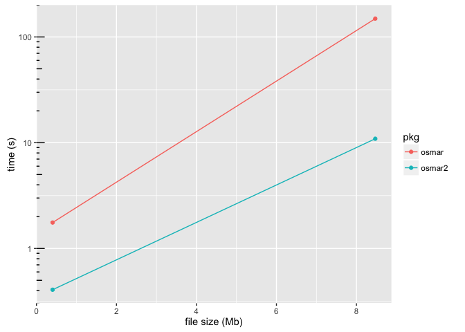

<!-- README.md is generated from README.Rmd. Please edit that file -->
osmar2
======

osmar2 is a version of the [osmar package](http://cran.r-project.org/package=http://cran.r-project.org/package=osmar) ("OpenStreetMap and R") rewritten to use xml2 package instead of XML, and some other adaptations to allow for much quicker reading of .osm files. Currently, only the functions for data import (`get_osm()` for `osmsource_file()` and the functions it calls have been changed), and I believe I have done so in a way that is backwards compatible, (or at least, it has been in the ways I have used osmar objects so far).

Speed Comparison
----------------

``` r
# install.packages("osmar")
# install.packages("devtools")
# devtools::install_github("gergness/osmar2")
# install.packages("microbecnhmark")
# install.packages("ggplot2")

suppressMessages({
  library(osmar2)
  library(microbenchmark)
  library(ggplot2)
})

tiny_file <- tempfile()
download.file("https://dl.dropboxusercontent.com/u/2019891/osmar2/TC_tiny_osm_file.osm", tiny_file)

mb_tiny <- microbenchmark(
  osmar = osmar::get_osm(complete_file(), osmsource_file(tiny_file)),
  osmar2 = osmar2::get_osm(complete_file(), osmsource_file(tiny_file)),
  times = 5
)

mb_tiny
#> Unit: milliseconds
#>    expr       min        lq      mean    median        uq       max neval
#>   osmar 1655.2655 1670.3641 1759.0329 1722.2819 1759.6678 1987.5850     5
#>  osmar2  384.7872  391.3149  407.4559  398.2454  413.1504  449.7816     5
```

Even more benefits as files get bigger

``` r
small_file <- tempfile()
download.file("https://dl.dropboxusercontent.com/u/2019891/osmar2/TC_small_osm_file.osm", small_file)

mb_small <- microbenchmark(
  osmar = osmar::get_osm(osmar::complete_file(), osmar::osmsource_file(small_file)),
  osmar2 = osmar2::get_osm(osmar2::complete_file(), osmar2::osmsource_file(small_file)),
  times = 1
)

mb_small
#> Unit: seconds
#>    expr       min        lq      mean    median        uq       max neval
#>   osmar 149.06799 149.06799 149.06799 149.06799 149.06799 149.06799     1
#>  osmar2  10.90728  10.90728  10.90728  10.90728  10.90728  10.90728     1

speed_df <- data.frame(
  `file size (Mb)` = rep(file.size(c(tiny_file, small_file)), each = 2) / (1012 ^ 2),
  pkg = rep(c("osmar", "osmar2"), 2),
  `time (s)` = c(summary(mb_tiny, unit = "s")$mean, 
            summary(mb_small, unit = "s")$mean), 
  check.names = FALSE
)

ggplot(data = speed_df, aes(x = `file size (Mb)`, y = `time (s)`, group = pkg, color = pkg)) +
  geom_path() + geom_point() + 
  scale_y_log10() +
  annotation_logticks(base = 10, sides = "l")
```



osmar2 even has tolerable load times (~7 minutes) for a ~125Mb file. I haven't checked how long this would take on osmar.

``` r
# Too slow to run regularly...
big_file <- tempfile()
download.file("https://dl.dropboxusercontent.com/u/2019891/osmar2/TC_big_osm_file.osm", big_file)

mb_big <- microbenchmark::microbenchmark(
 osmar2 = osmar2::get_osm(complete_file(), osmsource_file(big_file)),
 times = 1
)

mb_big
```

Development
-----------

I don't plan to do much further development on osmar2, but wanted to post it publicly in case it is useful for anyone else. I believe that it could be written to be much faster with, because it is currently scanning through the XML document many times.

I will try to help with issues and work with PRs, but please be patient :)
